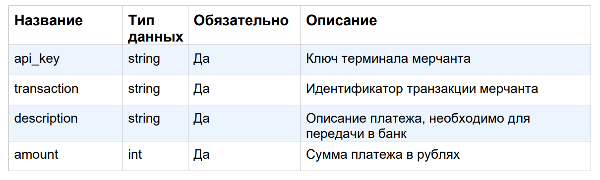
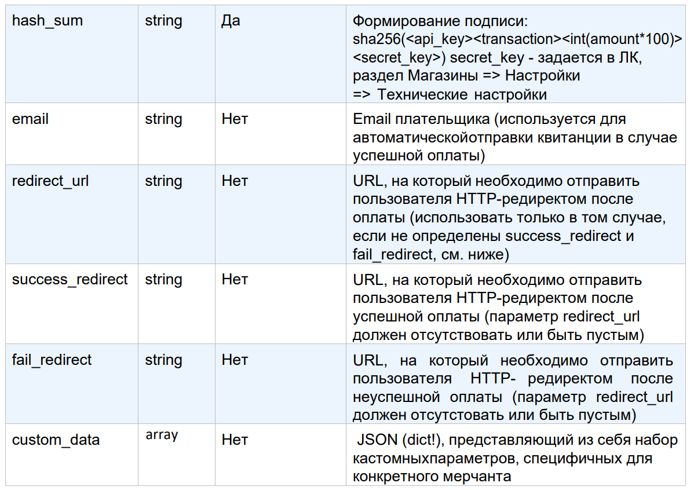

# payment-form (React)

Необходимо реализовать на Vue/React страницу по макету (без адаптива):
https://www.figma.com/design/k4Oipiib4LZpVvVgAJ6Bgs/Untitled?node-id=0-1&t=oY7W1iOhnaSFptOz-1

Имя инициатора сборов {Иван.К} и название сбора {Экскурсия} приходит с разводящей
страницы, для тестового задания задать в переменных произвольные значения.

## Инпуты:
1. маска карты 16Ц
2. маска даты ММ/ГГ
3. маска cvc 3Ц, маскированное отображение.
4. Сумма перевода, Ц, не менее 10 руб.
5. Имя, сообщение, 50БЦ.

## Скриптовая часть:
1. валидация номера карты по ЛУН алгоритму, если валидация не проходит - не пропускать
отправку данных.
2. имитация отправки данных на сервер (сформировать тело POST запроса, вывести на другую
страницу). Имя инициатора сборов {Иван.К} и название сбора {Экскурсия} отдать в поле
Custom_data.

```json
"api_key": "316b2be8-3475-4462-bd57-c7794d4bdb53"
"secret" : "1234567890"
```

Время выполнения задания 4-6 часов, если не успеваете - пришлите то что есть. Результат
предоставить ссылкой на github + ссылка на страницу, размещенную на сервере.

## Описание параметров запроса:





## Пример запроса:

```json
{
  "hash_sum": "14d85e69dc948e2f04e7494e4f5cdbc89ec2a19d30900c180516098ad365bedb",
  "transaction": "3243243244324",
  "description": "описание_платежа",
  "api_key": " fcee9d8e-cf54-4e88-8911-517b6708367b",
  "amount": 100,
  "email": "электронная_почта",
  "custom_data": {
    ...
  }
}
```
